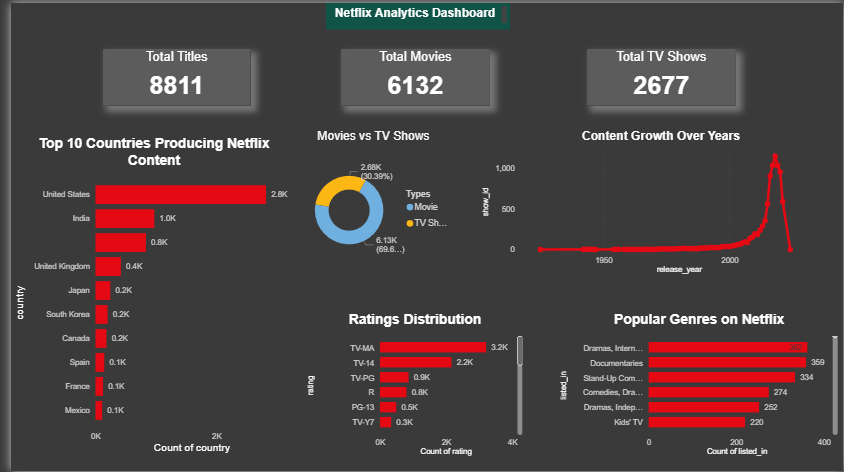

# 📊 Netflix Data Analytics Dashboard

## 📌 Overview

Analyzed Netflix Movies & TV Shows dataset and built an interactive Power BI dashboard to uncover insights on content trends, countries, genres, and ratings.

## 🛠 Tools Used

* Python (Pandas, Matplotlib, Seaborn)
* Power BI
* Jupyter Notebook

## 📊 Key Insights

* 📈 Content increased rapidly after 2015
* 🌍 USA produces the highest content
* 🎬 Movies dominate over TV Shows

## 📸 Dashboard Preview

